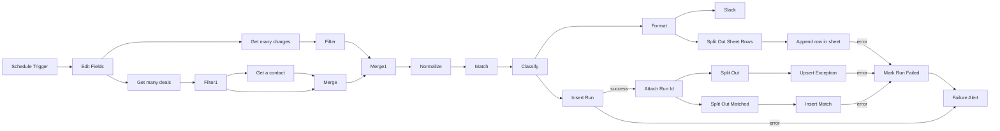

# Workflow architecture — Phase 5 assembly

Working note, not part of the locked repo layout (PLAN.md §4) — a snapshot of the
canvas as built this session, for verification. Source of truth is always the
n8n canvas / the exported `workflow.template.json`, not this file.

## Node graph

## Nodes 1-6 — upstream (Ahad, committed as `workflow.template.json`)

| # | Node | Type | Purpose |
|---|---|---|---|
| 1 | Schedule Trigger | scheduleTrigger | cron 2am nightly |
| 2 | Edit Fields | set | computes `window_start`/`window_end` (yesterday, UTC) |
| 3 | Get many charges | Stripe | fetch all charges |
| 4 | Filter | filter | charges within window (`created` gte/lt) |
| 5 | Get many deals | HubSpot | fetch all deals, incl. associations |
| 6 | Filter1 | filter | deals within window (`closedate` gte/lt) |
| — | Get a contact | HubSpot | contact per deal (email lives here) |
| — | Merge | merge (combine, by position) | deal + its contact, 1:1 |
| — | Merge1 | merge (append) | charges stream + deal/contact stream |

## Nodes 7-14 — downstream (Murad, canvas built this session)

| Node | Mode/Op | Reads | Produces |
|---|---|---|---|
| **Normalize** | Code, run once for all items | `$('Filter')`, `$('Filter1')`, `$('Get a contact')` directly (not Merge1's item — sidesteps trusting its shape) | `{ payments, deals }` (contract shape). Also drops zero-amount and non-succeeded charges (PLAN §7.2/§7.4) |
| **Match** | Code, run once for all items | `payments, deals` | `{ matchResult }` |
| **Classify** | Code, run once for all items | `matchResult` | `{ matchResult, exceptions }` |
| **Insert Run** | Postgres, Execute Query | `matchResult`, `exceptions`, `Edit Fields` window | one `runs` row, `RETURNING id` |
| **Attach Run Id** | Code, run once for all items | Insert Run's `id` + `$('Classify')`'s data | `{ runId, exceptions, matchResult }` — re-merges the two so downstream branches have both |
| **Split Out** | Split Out, field `exceptions`, include all other fields | Attach Run Id | one item per exception (+ `runId` carried along) |
| **Upsert Exception** | Postgres, Execute Query | Split Out items | upsert into `exceptions`, `ON CONFLICT (exception_type, charge_id, deal_id)` — the idempotency key |
| **Split Out Matched** | Split Out, field `matchResult.matched`, include all other fields | Attach Run Id | one item per matched pair (+ `runId`) |
| **Insert Match** | Postgres, Execute Query | Split Out Matched items | insert into `matches` |
| **Format** | Code, run once for all items | `matchResult, exceptions` (from Classify) | `{ blocks, sheetRows }` |
| **Slack** | HTTP Request, POST | Format's `blocks` | posts to Slack incoming webhook |
| **Split Out Sheet Rows** | Split Out, field `sheetRows` | Format | one item per exception, sheet-row shaped |
| **Append row in sheet** | Google Sheets, Append | Split Out Sheet Rows items | one row per exception in the tracking sheet |

## Error handling

`On Error: Continue (using error output)` set on: Insert Run, Upsert Exception,
Insert Match, Append row in sheet. Plain `Continue` on Slack (its own failure
isn't wired anywhere — by the time it runs, Postgres + Sheets have already
succeeded, so a webhook 404 shouldn't flip a genuinely-ok run to failed).

| Error output | Routes to | Why |
|---|---|---|
| Insert Run | `Failure Alert` directly | No `runs` row exists yet — nothing for `Mark Run Failed` to update |
| Upsert Exception | `Mark Run Failed` → `Failure Alert` | Run row already exists by this point |
| Insert Match | `Mark Run Failed` → `Failure Alert` | Same |
| Append row in sheet | `Mark Run Failed` → `Failure Alert` | Same |

`Mark Run Failed` — Postgres, `UPDATE runs SET status='failed', error=$1 WHERE id=$2`.
`Failure Alert` — HTTP Request, POSTs a plain failure notice to the same Slack webhook.

## Known gaps (not yet done, tracked here so they aren't lost)

- `subscriptionId` always `null` — Stripe charge object needs an `invoice.subscription`
  expand that "Get many charges" doesn't do yet. Config-gated skip in `classify.js`
  is a no-op until this is populated (see `docs/CONTRACT.md` addendum).
- `workflow/workflow.template.json` in git only has nodes 1-6 (Ahad's export).
  Nodes 7+ exist on canvas only until re-exported — `npm run build` will fail
  until that export lands (confirmed: `Error: inject.js: no node named "Normalize"...`).
- Not yet run against seeded data or tested for idempotency (Phase 5 exit criteria,
  PLAN.md §6 Phase 5) — needs the fresh export + a real `npm run build` + import.
